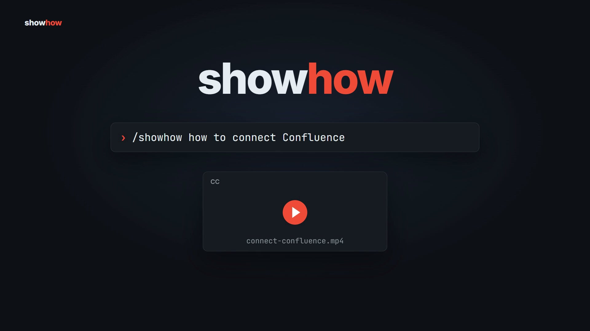

# showhow

**Turn your project into a narrated how-to or what's-new video, straight from the code.**

[](LICENSE)
[](https://skills.sh)
[](https://github.com/heygen-com/hyperframes)

`/showhow` is an agent skill for Claude Code, Codex, OpenCode and other agents that load `SKILL.md` skills.
It reads your code, docs and git history, writes a script and storyboard, rebuilds the real UI, and renders an MP4 with voice-over, captions, music and sound effects.
No screen recording, no live URL, no video editor.

[](https://github.com/Beer-de-Vreeze/showhow/raw/main/docs/how-showhow-works.mp4)

*How showhow works, made with showhow (41s, click to play).*

```text
/showhow how to connect Confluence
/showhow what's new in 2.4.0
/showhow --mode general how to share a calendar in Outlook
```

## Contents

- [What you get](#what-you-get)
- [Install](#install)
- [Usage](#usage)
- [Modes](#modes)
- [Styles, themes and voices](#styles-themes-and-voices)
- [Options](#options)
- [How it works](#how-it-works)
- [Privacy](#privacy)
- [Credits](#credits)
- [License](#license)

## What you get

Every run writes a folder to `~/Downloads/showhow-<video-name>/`:

| File | What it is |
|---|---|
| `<video-name>.mp4` | The rendered video |
| `<video-name>.jpg` | Poster frame, also baked into frame 0 |
| `captions.srt` | Captions that match the narration word for word |
| `chapters.txt` | Chapter timestamps for YouTube, Vimeo or an LMS |
| `showhow.md` | A written companion with the same steps |
| `share-copy.md` | A short post to share the video |
| `composition/` | The Hyperframes project, so you can edit and re-render |

## Install

### 1. Add the skill

With the [skills CLI](https://skills.sh), for any supported agent:

```bash
npx skills add Beer-de-Vreeze/showhow
```

Or as a Claude Code plugin:

```text
/plugin marketplace add Beer-de-Vreeze/showhow
/plugin install showhow@showhow
```

### 2. Add Hyperframes

showhow builds its videos with the [Hyperframes](https://github.com/heygen-com/hyperframes) skills, so install them next to it:

```bash
npx skills add heygen-com/hyperframes
```

### 3. Install the tools

On Windows, let the skill do it:

```text
/showhow install
```

This installs Node.js LTS, ffmpeg, Python 3.12, uv, Docker Desktop, whisper-cpp, a Python venv for Kokoro voices and MusicGen music, and the Hyperframes browser.
Restart your agent app afterwards so it picks up the new `PATH` and `HYPERFRAMES_PYTHON`.

On macOS and Linux, install these yourself:

| Tool | Used for |
|---|---|
| Node.js 20+ | `npx hyperframes` |
| ffmpeg | Rendering and audio |
| Python 3.12 + [uv](https://docs.astral.sh/uv/) | Helper scripts |
| A venv with `kokoro-onnx soundfile transformers torch numpy`, exported as `HYPERFRAMES_PYTHON` | Voice-over and generated music |
| [whisper.cpp](https://github.com/ggml-org/whisper.cpp) (`whisper-cli` on `PATH`) | Caption timing |

Then run `npx hyperframes browser ensure`.

## Usage

Open your project in your agent and describe the video:

```text
/showhow how to add knowledge to a project
/showhow --mode update 2.4.0
/showhow what's new since v2.3.0 --style release
/showhow how to restore a prompt version --format vertical --no-music
/showhow --mode general how a train gets its power --style cinematic --voice am_michael
/showhow options
```

`/showhow options` lists every style, theme and voice on your machine.

## Modes

| Mode | Use it for | The viewer can afterwards |
|---|---|---|
| `howto` | One task in your product | Do the task without the video |
| `update` | A release, tag, PR or commit range | Say what changed, where to find it and why it matters |
| `general` | A process, a third-party app, a physical task or a topic, no codebase needed | Do the task, or explain the topic |

The mode is inferred from your request.
Steps that happen outside your product, like creating an API token in a vendor portal before connecting it, work in every mode.
showhow researches them from official docs and rebuilds the screens with fictional data.

## Styles, themes and voices

Eleven styles, in every mode:

| Style | Feel |
|---|---|
| `clean` | Neutral, precise, product docs (default for how-tos) |
| `friendly` | Warm and encouraging, for first-time users |
| `release` | Punchy and beat-locked (default for updates) |
| `quick-tip` | One small trick in 20 to 40 seconds |
| `playful`, `polished`, `yc-parody`, `chaotic`, `deadpan`, `cinematic`, `app-store` | More personality, at teaching length |

Presets are a starting point: add freeform direction such as `--style "calm, like Apple support videos"`.

- **Themes:** `--theme <preset>` applies a Hyperframes frame preset to title cards, captions and step cards. Rebuilt product screens keep their own look.
- **Voices:** `--voice <id>` picks any [Kokoro](https://github.com/thewh1teagle/kokoro-onnx) voice. The default is `af_heart`. Narration is English.

## Options

| Option | Values | Default |
|---|---|---|
| `--mode` | `howto`, `update`, `general` | Inferred |
| `--style` (alias `--tone`) | A preset or a freeform description | `clean`, or `release` for updates |
| `--format` | `landscape`, `vertical`, `square` | `landscape` |
| `--duration` | Seconds | Set by the narration |
| `--audience` | Freeform, for example "new users" | Inferred |
| `--theme` | A frame preset name | The product's theme |
| `--voice` | A Kokoro voice id | `af_heart` |
| `--title` | Text | Inferred |
| `--no-voice` | Flag | Narration on |
| `--no-captions` | Flag | Captions on |
| `--no-music` | Flag | Music on |
| `--no-sfx` | Flag | Sound effects on |

Length limits keep videos watchable: how-tos run 45 to 120 seconds (3 minutes at most, longer topics are split), and updates cover 2 to 5 changes in 30 to 90 seconds.

## How it works

1. **Inspect.** Reads the code, docs and styles for the real flow, or git history and release notes for an update.
2. **Plan.** Writes `showhow-plan.md` with the goal, audience, narration script and a scene-by-scene storyboard.
3. **Compose.** Generates the voice-over and builds a Hyperframes composition that rebuilds your UI from its own components, styles and copy.
4. **Deliver.** Checks, renders and writes the captions, chapters, companion doc and share post.

Every video follows the same teaching rules: say the outcome first, highlight a target before acting on it, one action per step, hold each result until the narration finishes, and keep a step counter on screen.

## Privacy

Rendering, voice-over, captions and generated music run on your machine.
Only `general` mode and outside steps go online, to read official docs and capture public pages.
showhow skips `.env` files, keys and credentials while it reads your project, and replaces names, emails, hostnames, IDs and tokens with fictional values before anything reaches the video.
It never signs in to a site or types a password for you.

## Credits

- Built on [Hyperframes](https://github.com/heygen-com/hyperframes) by HeyGen.
- Styles, audio pipeline and parts of the workflow come from [brag](https://github.com/latent-spaces/brag) by Shunit Haviv Hakimi (MIT).
- Music: "Happy Beats / Business Moves" by Sascha Ende ([ende.app](https://ende.app/en)), [CC BY 4.0](https://creativecommons.org/licenses/by/4.0/). Videos that use a bundled track get the credit line in `credits.txt`.
- Sound effects: [Kenney](https://kenney.nl) and [unicae_games](https://opengameart.org/content/keyboard-soundpack-1-typing-and-single-keystrokes), CC0.

## License

[MIT](LICENSE) for the skill.
Bundled music and sound effects keep their own licenses, listed above.
